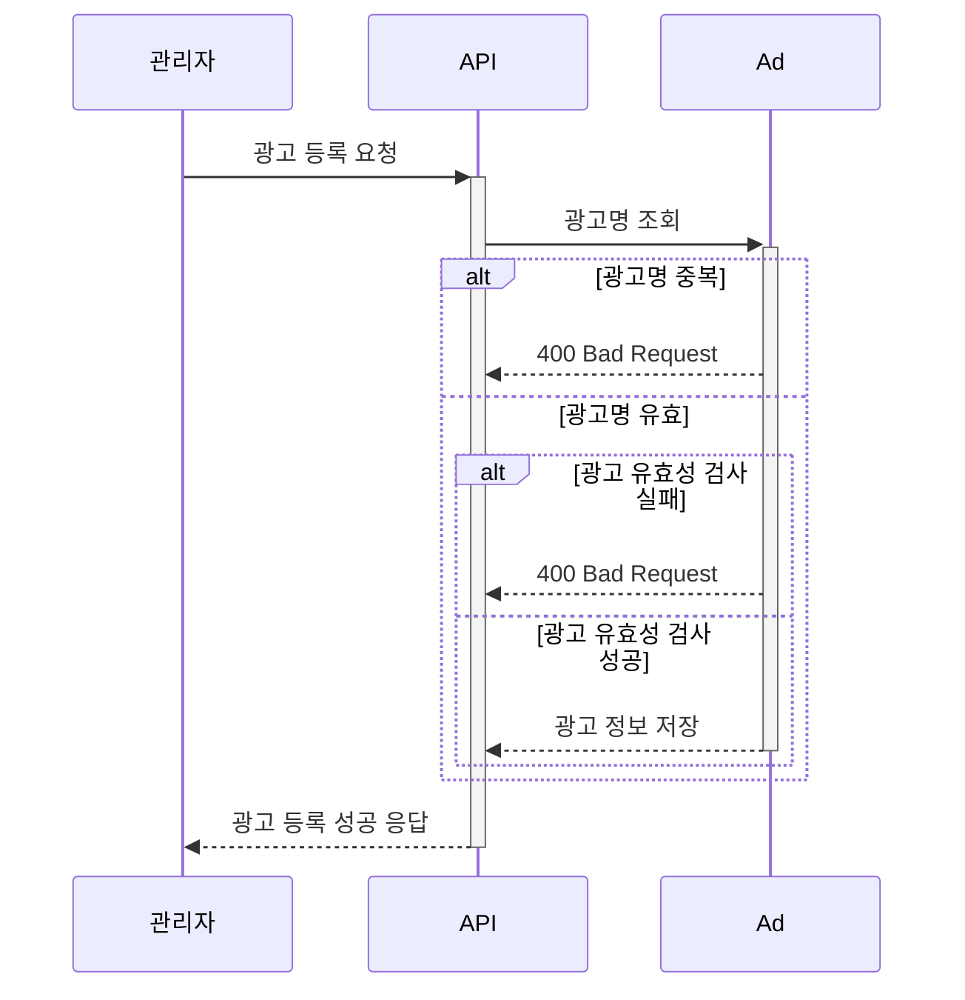
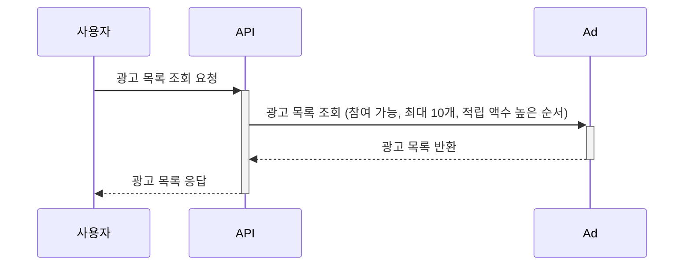
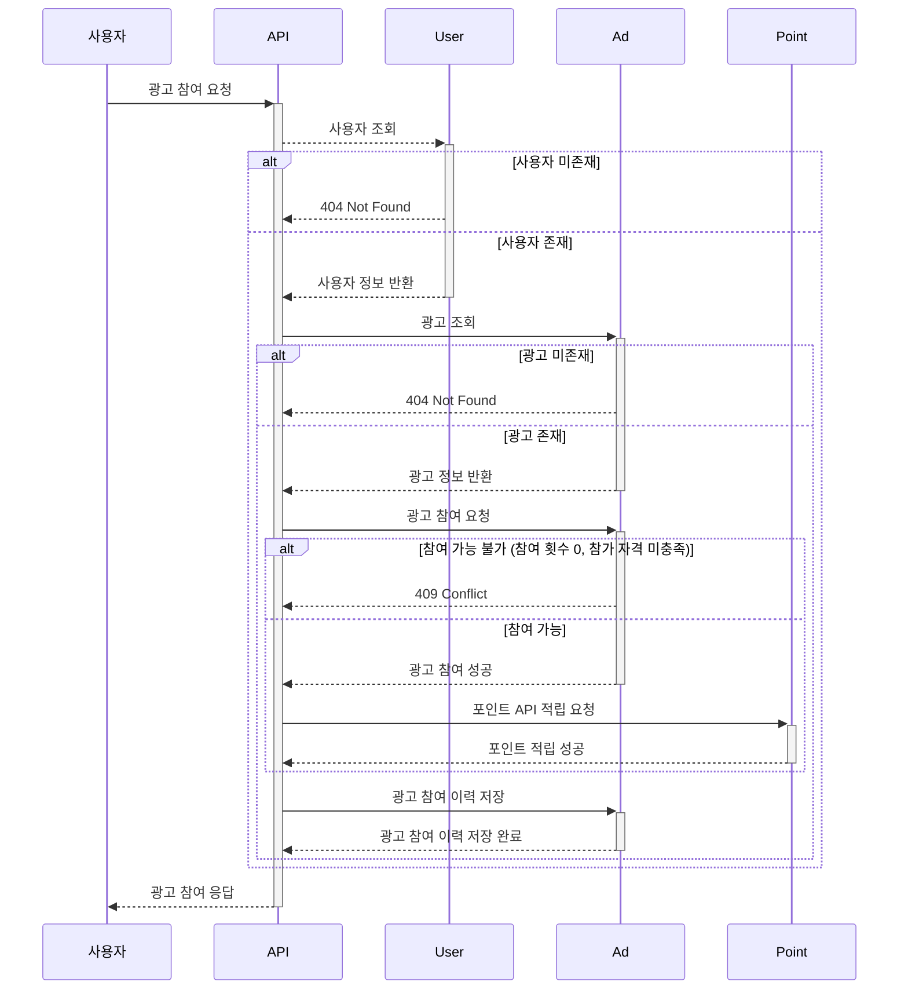
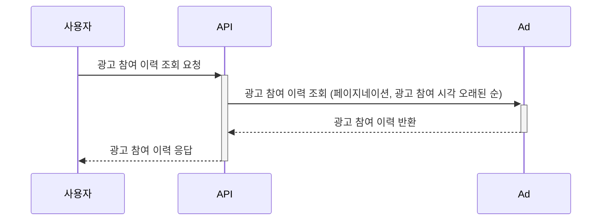

# 02. 시퀀스 다이어 그램

## 광고 등록

```mermaid
sequenceDiagram
    participant U as 관리자
    participant A as API
    participant AD as Ad
    
    U ->> + A: 광고 등록 요청
    A ->> + AD: 광고명 조회
    alt 광고명 중복
        AD -->> A: 400 Bad Request
    else 광고명 유효
        alt 광고 유효성 검사 실패 
            AD -->> A: 400 Bad Request
        else 광고 유효성 검사 성공
            AD -->> - A: 광고 정보 저장
        end
    end

    A -->> - U: 광고 등록 성공 응답
```

## 광고 목록 조회

```mermaid
sequenceDiagram
    participant U as 사용자
    participant A as API
    participant AD as Ad
    
    U ->> + A: 광고 목록 조회 요청
    A ->> + AD: 광고 목록 조회 (참여 가능, 최대 10개, 적립 액수 높은 순서)
    AD -->> - A: 광고 목록 반환
    A -->> - U: 광고 목록 응답
```

## 광고 참여

```mermaid
sequenceDiagram
    participant U as 사용자
    participant A as API
    participant US as User
    participant AD as Ad
    participant P as Point
    
    U ->> + A: 광고 참여 요청
    A -->> + US: 사용자 조회
    alt 사용자 미존재
        US -->> A: 404 Not Found
    else 사용자 존재
        US -->> - A: 사용자 정보 반환
        A ->> + AD: 광고 조회
        alt 광고 미존재
            AD -->> A: 404 Not Found
        else 광고 존재
            AD -->> - A: 광고 정보 반환
            A ->> + AD: 광고 참여 요청
            alt 참여 가능 불가 (참여 횟수 0, 참가 자격 미충족)
                AD -->> A: 409 Conflict
            else 참여 가능
                AD -->> - A: 광고 참여 성공
                A ->> + P: 포인트 API 적립 요청
                P -->> - A: 포인트 적립 성공
            end
            A ->> + AD: 광고 참여 이력 저장
            AD -->> - A: 광고 참여 이력 저장 완료
        end
    end
    A -->> - U: 광고 참여 응답
```

## 광고 참여 이력 조회

```mermaid
sequenceDiagram
    participant U as 사용자
    participant A as API
    participant AD as Ad
        
    U ->> + A: 광고 참여 이력 조회 요청
    A ->> + AD: 광고 참여 이력 조회 (페이지네이션, 광고 참여 시각 오래된 순)
    AD -->> - A: 광고 참여 이력 반환
    A -->> - U: 광고 참여 이력 응답
```

