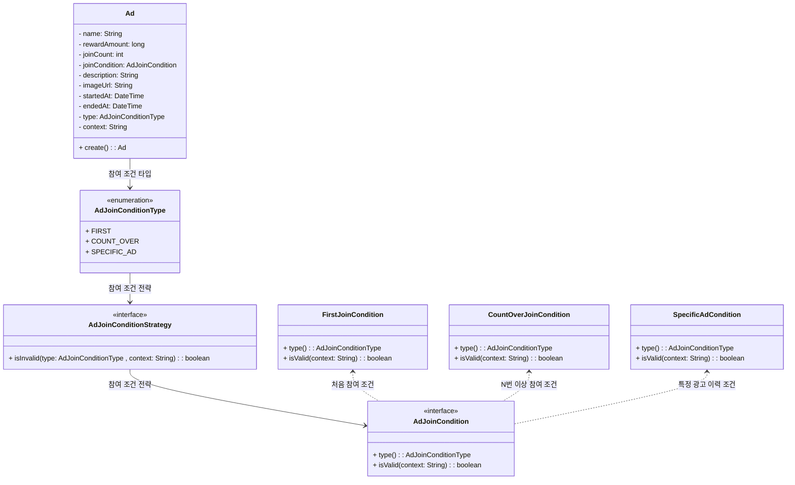
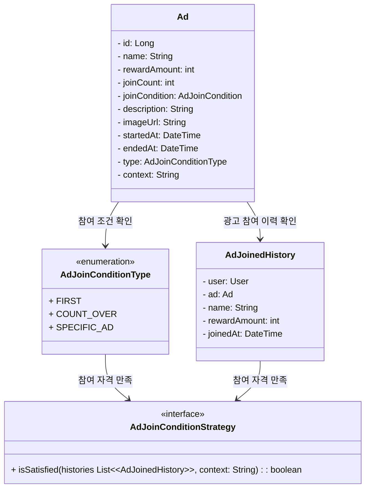
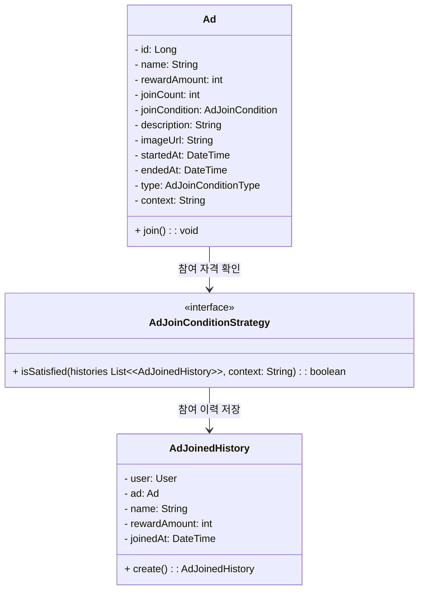
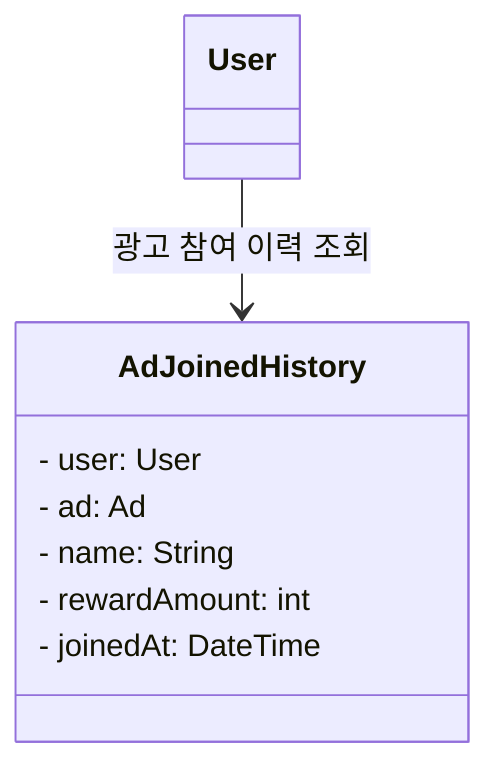

# 03. 클래스 다이어그램

## 광고 등록

```mermaid
classDiagram
    class Ad {
        - name: String
        - rewardAmount: long
        - joinCount: int
        - joinCondition: AdJoinCondition
        - description: String 
        - imageUrl: String
        - startedAt: DateTime
        - endedAt: DateTime
        - type: AdJoinConditionType
        - context: String
        + create(): Ad
    }
    
    class AdJoinConditionType {
        <<enumeration>>
        + FIRST
        + COUNT_OVER
        + SPECIFIC_AD
    }
    
    class AdJoinConditionStrategy {
        <<interface>>
        + isInvalid(type: AdJoinConditionType , context: String): boolean
    }
        
    class AdJoinCondition {
        <<interface>>
        + type() : AdJoinConditionType
        + isValid(context: String): boolean
    }
    
    class FirstJoinCondition {
        + type() : AdJoinConditionType
        + isValid(context: String): boolean
    }
    
    class CountOverJoinCondition {
        + type() : AdJoinConditionType
        + isValid(context: String): boolean
    }
    
    class SpecificAdCondition {
        + type() : AdJoinConditionType
        + isValid(context: String): boolean
    }

    Ad --> AdJoinConditionType : 참여 조건 타입
    AdJoinConditionType --> AdJoinConditionStrategy : 참여 조건 전략
    AdJoinConditionStrategy --> AdJoinCondition : 참여 조건 전략

    FirstJoinCondition <.. AdJoinCondition : 처음 참여 조건
    CountOverJoinCondition <.. AdJoinCondition : N번 이상 참여 조건
    SpecificAdCondition <.. AdJoinCondition : 특정 광고 이력 조건
```

## 광고 조회

```mermaid
classDiagram
    class Ad {
        - id: Long
        - name: String
        - rewardAmount: int
        - joinCount: int
        - joinCondition: AdJoinCondition
        - description: String
        - imageUrl: String
        - startedAt: DateTime
        - endedAt: DateTime
        - type: AdJoinConditionType
        - context: String
    }

    class AdJoinedHistory {
        - user: User
        - ad: Ad
        - name: String
        - rewardAmount: int
        - joinedAt: DateTime
    }

    class AdJoinConditionType {
        <<enumeration>>
        + FIRST
        + COUNT_OVER
        + SPECIFIC_AD
    }

    class AdJoinConditionStrategy {
        <<interface>>
        + isSatisfied(histories List~~AdJoinedHistory~~, context: String): boolean
    }

    Ad -->  AdJoinConditionType : 참여 조건 확인
    Ad --> AdJoinedHistory: 광고 참여 이력 확인
    AdJoinConditionType --> AdJoinConditionStrategy : 참여 자격 만족
    AdJoinedHistory --> AdJoinConditionStrategy: 참여 자격 만족
```

## 광고 참여

```mermaid
classDiagram
    class Ad {
        - id: Long
        - name: String
        - rewardAmount: int
        - joinCount: int
        - joinCondition: AdJoinCondition
        - description: String
        - imageUrl: String
        - startedAt: DateTime
        - endedAt: DateTime
        - type: AdJoinConditionType
        - context: String
        + join(): void
    }

    class AdJoinedHistory {
        - user: User
        - ad: Ad
        - name: String
        - rewardAmount: int
        - joinedAt: DateTime
        + create(): AdJoinedHistory
    }

    class AdJoinConditionStrategy {
        <<interface>>
        + isSatisfied(histories List~~AdJoinedHistory~~, context: String): boolean
    }

    Ad -->  AdJoinConditionStrategy : 참여 자격 확인
    AdJoinConditionStrategy --> AdJoinedHistory : 참여 이력 저장
```

## 광고 이력 조회

```mermaid 
classDiagram
    class AdJoinedHistory {
        - user: User
        - ad: Ad
        - name: String
        - rewardAmount: int
        - joinedAt: DateTime
    }

    User --> AdJoinedHistory : 광고 참여 이력 조회
```

