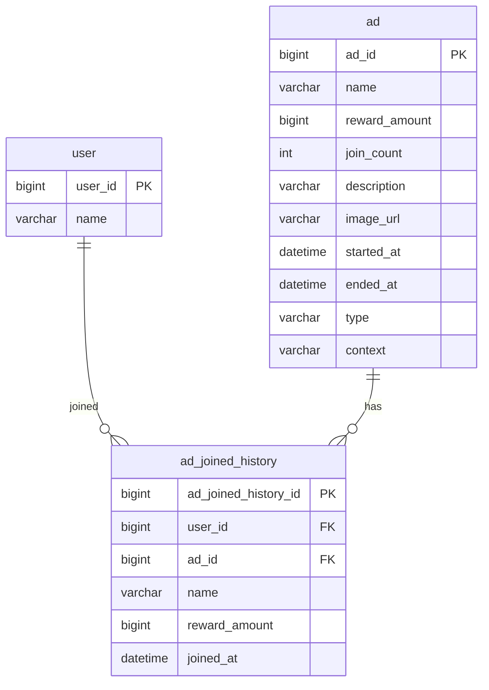

# 04. ERD

```mermaid
erDiagram
    ad {
        bigint ad_id PK
        varchar name
        bigint reward_amount
        int join_count
        varchar description
        varchar image_url
        datetime started_at
        datetime ended_at
        varchar type
        varchar context
    }
    
    ad_joined_history {
        bigint ad_joined_history_id PK
        bigint user_id FK
        bigint ad_id FK
        varchar name
        bigint reward_amount
        datetime joined_at
    }
    
    user {
        bigint user_id PK
        varchar name
    }

    user ||--o{ ad_joined_history : "joined"
    ad ||--o{ ad_joined_history : "has"

```